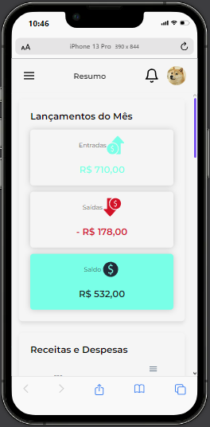

# My Finance


[](https://raw.githubusercontent.com/Jonatas-Serra/My-Finance/main/LICENSE)  

## 📝 Descrição

O **My Finance** é uma aplicação web para gerenciar suas finanças pessoais. Com ela, você pode controlar suas contas a pagar, contas a receber, transações e muito mais, tudo de forma simples e intuitiva.

## 🚀 Demonstração

### Desktop


### Mobile



## 🛠️ Tecnologias Utilizadas


## 📦 Instalação

Para rodar a aplicação localmente, siga os passos abaixo:

1. Clone o repositório:
   ```
   $ git clone https://github.com/Jonatas-Serra/My-Finance.git
   ```
2. Instale as dependências:
   ```
   $ cd my-finance
   $ npm install
   ```
3. Configure as variáveis de ambiente no arquivo `.env`.

4. Inicie a aplicação:
   ```
   $ npm start
   ```

## 🧑‍💻 Funcionalidades

- **Gerenciamento de Transações**: Adicione, edite e remova transações financeiras.
- **Contas a Pagar e a Receber**: Controle suas despesas e receitas com facilidade.
- **Filtros**: Filtre suas transações por data, tipo e status.
- **Responsividade**: Acesse a aplicação de qualquer dispositivo.

## 📚 Documentação da API

A documentação completa da API pode ser encontrada [aqui](./docs/api.md).

## 🔧 Como Contribuir

Se você deseja contribuir com o projeto, siga os passos abaixo:

1. Faça um fork do repositório.
2. Crie uma branch para sua feature:
   ```
   $ git checkout -b minha-feature
   ```
3. Comite suas alterações:
   ```
   $ git commit -m 'Minha nova feature'
   ```
4. Faça o push para a branch:
   ```
   $ git push origin minha-feature
   ```
5. Abra um Pull Request.

## 📄 Licença

Este projeto está licenciado sob a Licença MIT - veja o arquivo [LICENSE](LICENSE) para mais detalhes.

## 📬 Contato

Caso tenha alguma dúvida ou sugestão, sinta-se à vontade para me contatar:

- Email: jonatasserra@outlook.com
- LinkedIn: [jonatasserra](https://www.linkedin.com/in/jonatasserra/)
- GitHub: [Jonatas-Serra](https://github.com/Jonatas-Serra)

---

Feito com ❤️ por [Jonatas Serra](https://github.com/yourusername)
